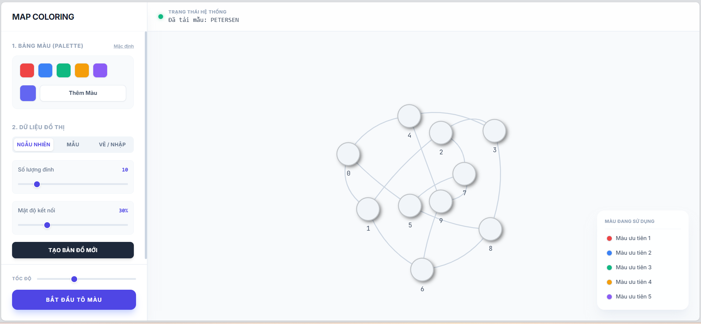
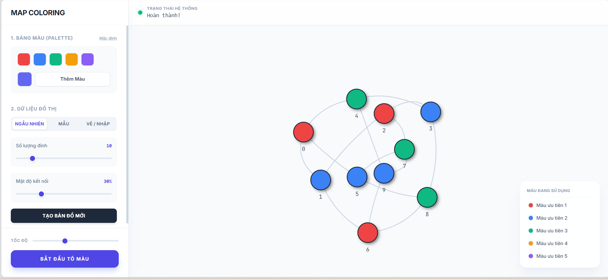

# Map Coloring - DSATUR Algorithm Visualization

Đây là dự án minh họa bài toán **Tô màu đồ thị (Graph Coloring Problem)** sử dụng thuật toán **DSATUR (Degree of Saturation)** kết hợp với Backtracking.


Ứng dụng là một Flask web app cho phép sinh đồ thị ngẫu nhiên, tải các mẫu đồ thị nổi tiếng (Petersen, Star, Wheel...), hỗ trợ vẽ đồ thị bằng tay và hiển thị trực quan từng bước quá trình tô màu.

## 📂 Cấu trúc dự án

* **`app.py`**: Flask server chính, xử lý định tuyến (routing) và giao tiếp giữa Client-Server.
* **`solve.py`**: Chứa logic cốt lõi của thuật toán **DSATUR**, được viết theo mô hình hướng đối tượng (OOP) và sạch (Clean Code).
* **`templates/index.html`**: Giao diện người dùng (Dashboard Style) sử dụng Tailwind CSS và Vis.js để vẽ đồ thị.
* **`static/js/script.js`**: Script xử lý logic phía client (gọi API, quản lý Tab, xử lý Animation, vẽ tương tác).

## ⚙️ Yêu cầu cài đặt

* **Hệ điều hành**: Windows, Linux hoặc macOS.
* **Python**: Phiên bản 3.8 trở lên.

### Các bước cài đặt:

1.  Tạo môi trường ảo (khuyên dùng):
    ```bash
    python -m venv venv
    ```

2.  Kích hoạt môi trường ảo:
    * **Windows:**
        ```bash
        venv\Scripts\activate
        ```
    * **Linux/macOS:**
        ```bash
        source venv/bin/activate
        ```

3.  Cài đặt thư viện Flask:
    ```bash
    pip install Flask
    ```

## 🚀 Chạy ứng dụng

1.  Tại thư mục gốc của dự án, chạy lệnh:
    ```bash
    python app.py
    ```

2.  Khi thấy thông báo sau xuất hiện trong console:
    ```text
     * Serving Flask app 'app'
     * Debug mode: on
     * Running on [http://127.0.0.1:5000/](http://127.0.0.1:5000/) (Press CTRL+C to quit)
    ```

3.  Mở trình duyệt web và truy cập: [http://127.0.0.1:5000/](http://127.0.0.1:5000/)

## 📡 Tài liệu API

Ứng dụng cung cấp 2 API chính:

### 1. Sinh đồ thị ngẫu nhiên
* **Endpoint**: `POST /generate-random`
* **Body (JSON)**:
    ```json
    {
      "nodes": 10,       // Số lượng đỉnh
      "density": 0.4     // Mật độ cạnh (0.0 - 1.0)
    }
    ```
* **Phản hồi (Response)**:
    ```json
    {
      "nodes": [{"id": 0, "label": "0"}, ...],
      "edges": [{"from": 0, "to": 1}, ...]
    }
    ```

### 2. Giải thuật toán tô màu
* **Endpoint**: `POST /solve`
* **Body (JSON)**:
    ```json
    {
      "nodes": [...],    // Danh sách đỉnh từ Vis.js
      "edges": [...],    // Danh sách cạnh từ Vis.js
      "num_colors": 3    // Số lượng màu trong Palette
    }
    ```
* **Phản hồi (Response)**:
    ```json
    {
      "success": true,
      "history": [       // Lịch sử các bước để diễn hoạt
        {"node": 0, "color_index": 1, "action": "try"},
        {"node": 1, "color_index": 0, "action": "backtrack"},
        ...
      ]
    }
    ```

## Demo

<h3>Sinh mê cung</h3>


<h3>Giải mê cung bằng A*</h3>

